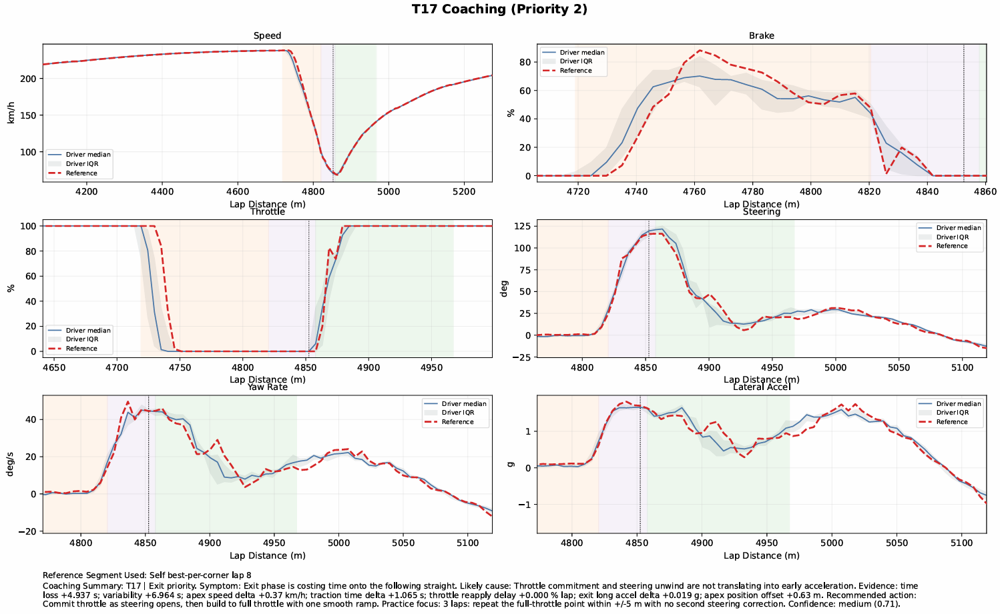
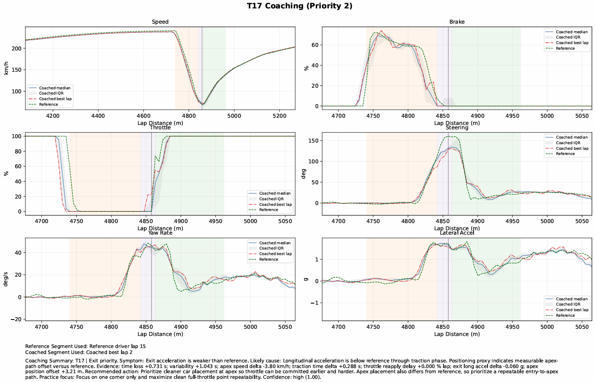

# iRacing-Driving-Coach

Deterministic driver-coaching pipeline for Mu-exported iRacing telemetry.

## Project Overview

This project analyzes iRacing telemetry and automatically produces actionable coaching outputs from a single command, keeping the core logic deterministic and auditable.

It is designed for users who may not be experts in telemetry analysis and are interested in improving their laptime and data driven training techniques.

Main outcomes:
- Valid-lap filtering and distance-aligned lap comparison.
- Per-corner braking, rotation, and traction analysis.
- Corner ranking by time loss and inconsistency.
- Structured coaching comments with confidence.
- Automatic coaching PDF report generation.

The software supports two operation modes:
1. `single-session`: Analyze one driver session against that driver's own best-corner benchmark.
2. `vs-reference`: Compare a coached driver session against a faster reference driver session.

## Example Outputs

The final output is a coaching report that combines telemetry plots with deterministic driver-coaching comments. The screenshots below show the same corner format in the two supported modes.

Plot guide:
- Orange background: braking phase.
- Purple background: rotation / mid-corner phase.
- Green background: traction / exit phase.
- Vertical dotted line: detected apex.
- Blue line and grey band: coached driver median and interquartile range across valid laps.
- Red line: coached driver's best lap or best-corner segment.
- Green dashed line: faster reference driver in `vs-reference` mode.

<p align="center">
  
  
</p>

Left: `single-session` report. Right: `vs-reference` report.

Full example PDF reports are included in the repository:
- `coaching_report_single.pdf`.
- `coaching_report_reference.pdf`.

## External Tools and Boundary

- Mu is an external prerequisite and is required to convert iRacing `.ibt` files to `.csv`.
- Mu is not replaced or reimplemented by this project.
- Optional MoTeC i2 files can be produced from Mu for visual validation, but MoTeC is not the computation engine.

Mu credit and download:
- [Mu (v1.9.5.0) by Patrick Moore](https://github.com/patrickmoore/Mu/releases/tag/1.9.5.0).

## Prerequisites (Final User)

1. Windows terminal (PowerShell or CMD).
2. Python 3.10+ installed and available in terminal.
3. Mu installed and able to export iRacing telemetry to CSV.

Check Python:
- `python --version`.
- `py --version` if `python` is not available.

## Install Python (If Needed)

1. Install Python 3.10+ on Windows.
2. Enable `Add python.exe to PATH` during installation.
3. Re-open terminal and verify the version.

## Install Mu (If Needed)

1. Install Mu from the link above.
2. Convert iRacing `.ibt` files to `.csv`.
3. Confirm Mu CSV format follows the expected structure documented below.

## Install Dependencies

From this project folder:

```powershell
python -m pip install -r requirements.txt
```

Or:

```powershell
py -m pip install -r requirements.txt
```

## Quick Start

### Mode 1: Single-Session (Your Session Only)

```powershell
python .\TelemetryAnalyzer.py "C:\path\to\my_session.csv"
```

If `python` is not available:

```powershell
py .\TelemetryAnalyzer.py "C:\path\to\my_session.csv"
```

What this mode does:
- Detects corners from your own session.
- Computes per-corner metrics for all valid laps.
- Builds a best-per-corner internal benchmark.
- Ranks priority corners by time loss, variability, and relevance score.
- Generates coaching CSV/JSON outputs.
- Generates a coaching PDF report (`coaching_report.pdf`).

### Mode 2: Coached Driver vs Faster Reference Driver

```powershell
python .\TelemetryAnalyzer.py "C:\path\to\my_session.csv" --vs-reference "C:\path\to\faster_driver_session.csv"
```

If `python` is not available:

```powershell
py .\TelemetryAnalyzer.py "C:\path\to\my_session.csv" --vs-reference "C:\path\to\faster_driver_session.csv"
```

What this mode does:
- Detects canonical corners on the reference session.
- Reuses those corner IDs and boundaries for the coached driver session.
- Builds reference benchmark from best corner segments in the reference session.
- Scores coached driver corner performance vs reference benchmark.
- Generates coaching CSV/JSON outputs.
- Generates a coaching PDF report (`coaching_report.pdf`) with overlays.
- Shows coached median and coached IQR traces.
- Shows coached best-corner lap trace.
- Shows reference trace.

By default, this mode expects:
- Same track configuration (`Venue`).
- Same vehicle (`Vehicle`).

Intentional cross-car comparison:

```powershell
python .\TelemetryAnalyzer.py "C:\path\to\my_session.csv" --vs-reference "C:\path\to\ref.csv" --allow-mixed-vehicle
```

## Optional Runtime Flags

- `--config <path>` loads deterministic tuning parameters from JSON.
- `--allow-mixed-vehicle` allows cross-car comparison in `vs-reference` mode.
- `--disable-reference-cache` disables shared cached reference-session artifacts.

Example:

```powershell
python .\TelemetryAnalyzer.py "C:\path\to\my_session.csv" --config ".\pipeline_config.json"
```

## Example Config File

```json
{
  "lap_validity": {
    "min_samples": 1000,
    "min_dist_span_pct": 95.0
  },
  "corner_detection": {
    "min_corner_count": 10,
    "max_corner_count": 25,
    "min_corner_spacing_m": 90.0,
    "curvature_weight": 0.35,
    "manual_apex_pct": null
  },
  "coaching": {
    "max_priority_corners": 5,
    "min_time_loss_s": 0.03,
    "min_inconsistency_s": 0.04
  },
  "comparison": {
    "allow_mixed_vehicle": false,
    "reference_cache_enabled": true
  }
}
```

The resolved runtime configuration is always saved to:
- `outputs/<session-id>/config_snapshot.json`.

## What the Program Always Does

- Parses metadata, units, and numeric telemetry from Mu CSV.
- Preserves raw channels and adds derived channels separately.
- Classifies valid and invalid laps deterministically.
- Excludes out, warm-up, partial, and contaminated laps by explicit rules.
- Aligns valid laps by distance (`LapDistPct`) on a shared grid.
- Detects corners from a deterministic multi-signal profile.
- Segments each corner into braking, rotation, and traction phases.
- Computes per-corner metrics and coaching relevance ranking.
- Generates deterministic coaching comments with evidence and confidence.
- Writes reproducible artifacts (CSV/JSON/GZ).
- Generates PDF coaching report.

## Saved Artifacts

Every run writes to a session-specific folder:
- `outputs/<session-id>/...`.

Core artifacts:
- `telemetry_numeric.csv.gz`.
- `metadata.json`.
- `units.json`.
- `parse_report.json`.
- `laps/lap_summary.csv`.
- `laps/aligned_laps_by_distance.csv.gz`.
- `laps/alignment_report.json`.
- `config_snapshot.json`.
- `coaching_report.pdf`.

Single-session analysis outputs:
- `corners/corner_definitions.csv`.
- `corners/corner_lap_metrics.csv.gz`.
- `corners/corner_ranking.csv`.
- `corners/corner_reference_profile.csv`.
- `corners/corner_report.json`.
- `coaching/corner_coaching.csv`.
- `coaching/session_coaching_summary.json`.
- `coaching/coaching_report.json`.

Vs-reference additional outputs:
- `corners_vs_reference/corner_definitions.csv`.
- `corners_vs_reference/corner_lap_metrics.csv.gz`.
- `corners_vs_reference/corner_ranking.csv`.
- `corners_vs_reference/corner_reference_profile.csv`.
- `corners_vs_reference/corner_report.json`.
- `coaching_vs_reference/corner_coaching.csv`.
- `coaching_vs_reference/session_coaching_summary.json`.
- `coaching_vs_reference/coaching_report.json`.

Reference cache outputs (when enabled):
- `outputs/_reference_cache/<cache-key>/...`.

If cache is disabled:
- `outputs/<driver-session-id>/comparison_reference_session/<reference-session-id>/...`.

Additional notes:
- `<session-id>` is auto-built from metadata (date/time/vehicle/venue/session/driver).
- Large tables are stored as `.csv.gz` to reduce disk usage without data loss.

## Lap Comparison Approach

- Laps are classified as valid/invalid using deterministic rules:
  - lap ID must be >= 1 (ignores lap 0 out/warm-up by default),
  - enough telemetry samples (`>= 1000`),
  - sufficient distance coverage (`start <= 1%`, `end >= 99%`, span `>= 95%`),
  - no pit-road contamination (`OnPitRoad` fraction must be `0` when channel exists),
  - lap must be mostly on track (`IsOnTrack` fraction `>= 0.99` when channel exists).
- Comparisons are done by `LapDistPct` distance alignment, not by time.
- Valid laps are interpolated onto a shared distance grid (`0.1%` step) for direct point-by-point comparison.

## Corner Coaching Metrics

- Corner apexes are detected deterministically from local peaks in a corner-activity score combining:
  - speed deficit,
  - yaw-rate demand,
  - lateral acceleration,
  - steering demand,
  - path curvature (when `Lat`/`Lon` is available).
- Corner boundaries are defined from neighboring apex midpoints.
- Apex candidates are filtered with a minimum physical spacing target (meters), converted to `% lap` using estimated lap length from `Lat/Lon` when available. This reduces over-splitting of one complex into multiple false corners on different track lengths.
- For known tracks with an official turn-count mapping (currently Miami GP), detection is constrained to that official corner count for clearer T1/T2/... references.
- Per-corner phase boundaries are represented as:
  - braking phase (`brake_start_pct` to `brake_end_pct`)
  - rotation phase (`rotation_start_pct` to `rotation_end_pct`, around apex)
  - traction phase (`traction_start_pct` to `corner_end_pct`)
- Raw pedal channels are used when available (`BrakeRaw`, `ThrottleRaw`) for phase detection and pedal metrics.
- Additional outputs include traction wheel-speed spread and body-slip proxy from velocity channels when available.
- A conservative positioning proxy (`apex_position_delta_m` vs reference) is included when `Lat/Lon` channels are present.
- Per-corner ranking supports:
  - time loss vs deterministic reference profile
  - variability / inconsistency
  - robust ranking blend (mean + median for time loss, std + MAD for inconsistency)
  - combined coaching relevance score
- The report also includes a deterministic theoretical optimal lap time:
  - optimal lap = sum of best `corner_time_s` across corners
  - potential gain = best full lap time minus theoretical optimal lap time

## Configuration Tuning (Advanced)

Default values are tuned for FIA-style road/street circuits.  
If you analyze very different layouts (for example ovals), these are the main knobs to review.

### 1) Corner detection (most important)

File: `telemetry_pipeline/corner_metrics.py` (`CornerDetectionConfig`)

- `min_corner_count`, `max_corner_count`, `target_corner_count`:
  expected number of significant corners.
  - Road/street: keep broad range or set track-specific target if known.
  - Ovals: typically much lower counts (for example 2-6 depending on configuration).
- `min_corner_spacing_m`, `min_corner_spacing_pct`:
  minimum spacing between detected apexes.
  - Increase to avoid over-splitting long-radius turns.
  - Decrease slightly for tight technical complexes.
- `activity_quantile_threshold`, `min_activity_score`:
  sensitivity of peak acceptance.
  - Increase for cleaner but fewer corner detections.
  - Decrease if true corners are being missed.
- `curvature_weight`:
  balance between dynamic signals (yaw/lat accel/steer/speed deficit) and path geometry (`Lat`/`Lon`).
  - Increase when geometric path is reliable and useful.
  - Keep moderate to avoid geometry noise dominating.
- `speed_apex_search_window_pct`:
  local search window used to refine apex to minimum speed.
- `manual_apex_pct`:
  optional list of official corner apex positions in percentage lap distance.
  - Use only when a circuit has been validated against onboard video, MoTeC, or an official map.
  - When provided, automatic peak selection is bypassed, but braking, rotation, traction phases and all metrics are still computed from telemetry.
  - This is useful for official turn numbering on circuits where small labelled turns do not always create clean standalone telemetry apexes.

### 2) Phase boundaries

File: `telemetry_pipeline/corner_metrics.py` (`CornerDetectionConfig`)

- `brake_threshold_pct`
- `throttle_reapply_threshold_pct`
- `throttle_reapply_consecutive_points`

These control where braking/rotation/traction phases begin and end.  
If pedal channels are noisier or differently scaled, these are the first values to retune.

### 3) Lap validity and alignment

File: `telemetry_pipeline/lap_processing.py`

- `LapValidityConfig.min_samples`, `min_dist_span_pct`, `min_ontrack_fraction`, etc.
- `DEFAULT_DISTANCE_STEP_PCT` (alignment resolution)

Use stricter validity thresholds for cleaner datasets, or relax carefully for sparse telemetry.

### 4) Coaching threshold sensitivity

File: `telemetry_pipeline/coaching.py` (`CoachingConfig`)

- `min_time_loss_s`, `min_inconsistency_s`, `min_priority_score`
- `significant_*` thresholds (brake/rotation/traction/yaw/steer/slip/etc.)

These values change how strict the coaching engine is when labeling an issue as meaningful.

### 5) Known-track official turn counts

File: `telemetry_pipeline/cli.py` (`_infer_expected_corner_count`)

- If you want fixed official turn numbering for additional tracks, add mappings there.
- If no mapping is defined, the detector runs in generic track-agnostic mode.

## Interpreting Confidence and Priority Score (Academic Use)

- `coaching_priority_rank` orders corners by intervention value (1 = highest priority).
- The ranking is computed deterministically from:
  - time loss versus the selected reference,
  - variability/inconsistency across valid laps,
  - coaching relevance weighting from the phase and symptom evidence.
- In single-session mode, the reference is built from the driver's best corner segment per corner.
- In vs-reference mode, the reference is built from the faster reference driver session.
- `confidence` (0.00 to 1.00) expresses evidence strength for the coaching conclusion, not driver quality.
- Confidence increases when:
  - the signal pattern is consistent across laps,
  - multiple channels support the same diagnosis (for example speed + brake + yaw),
  - core channels needed for that diagnosis are available.
- Confidence decreases when:
  - evidence is weak or contradictory,
  - behavior varies strongly lap to lap,
  - key channels for that inference are missing.
- Suggested interpretation bands:
  - `>= 0.80`: high confidence (safe to prioritise immediately),
  - `0.60 to 0.79`: medium confidence (good candidate, verify with overlays),
  - `< 0.60`: low confidence (treat as hypothesis, require extra validation).

## Mu Export Format Expected

Mu CSV must contain:
1. Metadata lines at the top.
2. One blank line.
3. Header row.
4. Units row.
5. Sampled telemetry rows.

## Troubleshooting

- `ModuleNotFoundError: No module named 'pandas'`.
- Install with `python -m pip install pandas`.
- Install with `py -m pip install pandas` if needed.
- `Missing dependency: matplotlib`.
- Install with `python -m pip install matplotlib`.
- Install with `py -m pip install matplotlib` if needed.
- `File not found`.
- Check CSV path and quotes.

## Final Notes

- Mu is mandatory for `.ibt` to `.csv` conversion.
- This project starts after conversion and performs deterministic telemetry analytics and coaching.
- Raw telemetry channels are preserved, and derived channels are added separately (`Speed_kmh`, `SteeringWheelAngle_deg`, `YawRate_deg_s`).
